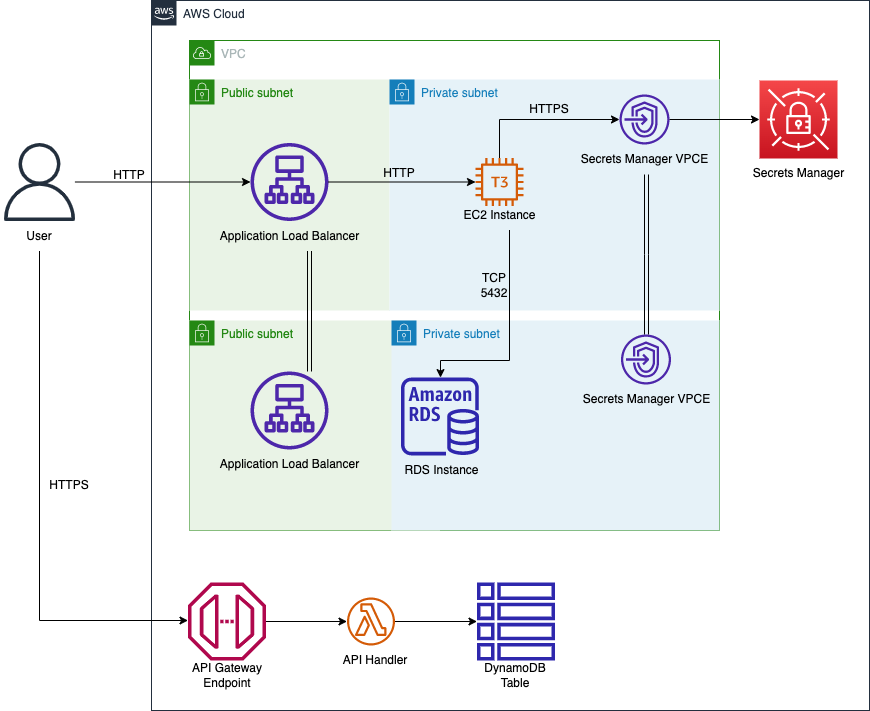

# Monolith-to-Microservices-Foundation-Blueprint
The Monolith-to-Microservices Foundation Blueprint is an AWS CDK application written in Python. The goal of the blueprint is to demonstrate setting up a legacy monolith on an EC2 instance and then migrate to a modern microservice using AWS API Gateway, Lambda, and DynamoDB. Included is an an implementation of the [strangler fig pattern](https://docs.aws.amazon.com/prescriptive-guidance/latest/modernization-aspnet-web-services/fig-pattern.html), which is a way to reduce risk when modernizing monolithic applications.

The `Makefile` includes commands for installing local dependencies, deploying the CDK application, and cleaning up. The application contains three stacks and the `--exclusively` flag is used to deploy the stacks individually within the same CDK application. This provides a phased approach to deploying the blueprint. This document will serve as a guide to set up and verify the monolith, microservice, and writeback function.

## Application
What this application aims to do is take any given USA zip code and provide it's county and state in JSON return format.  
The pattern to input your zipcode is in the URL bar as a PATH parameter.

Monolith example:

GET http://127.0.0.1:5000/zipcode/20001

Microservice example:

GET https://<YOUR_API_GATEWAY>.execute-api.<AWS-REGION>.amazonaws.com/prod/zipcode/20001

The response should look like this:

```json
{  
    "city": "Washington",  
    "county": "District Of Columbia",  
    "latitude": "38.911936",  
    "longitude": "-77.016719",  
    "state": "DC",  
    "zip_code": "20001"  
}  
```


# Prerequisites
## Local
* Linux/MacOS
* [Homebrew](https://brew.sh) installed
* make
* python3


The following dependencies will be installed via Homebrew:

* nvm - used to install and run the node version specified in `.nvmrc` and then installs the CDK cli globally via npm
    * Note that if this is your first time installing nvm, please update your [bash or zsh profile](https://formulae.brew.sh/formula/nvm#default):
    ```bash
    export NVM_DIR="$HOME/.nvm"
    [ -s "$HOMEBREW_PREFIX/opt/nvm/nvm.sh" ] && \. "$HOMEBREW_PREFIX/opt/nvm/nvm.sh" # This loads nvm
    [ -s "$HOMEBREW_PREFIX/opt/nvm/etc/bash_completion.d/nvm" ] && \. "$HOMEBREW_PREFIX/opt/nvm/etc/bash_completion.d/nvm" # This loads nvm bash_completion
    ```
* awscli - needed for port-forwarding over SSM
* session-manager-plugin - needed for port-forwarding over SSM
* docker - used by the CDK to build the python lambda writeback function

## AWS Account
An AWS Account with administrator access is required


# Clone the repository
* Navigate terminal to clone the project repo located here:
* `git clone https://github.com/VerticalRelevance/Monolith-to-Microservices-Foundation-Blueprint`
* `cd Monolith-to-Microservices-Foundation-Blueprint/`


# Configure your AWS Credentials
* `export AWS_PROFILE=<profile>`
* `aws configure set region <region>`


# Install dependencies, bootstrap the AWS environment, and ensure that the CDK stacks are able to synthesize
* `make`


# Deploy the monolith


* `make deploy-monolith` - This will deploy the VPC and monolith-db instance into a private subnet
* `make port-forward` - Port-forward to the database on localhost:5432 using SSM
    * `make hydrate-monolith` - Hydrate the monolith database with zipcode data


## Verify that the monolith is working
* `make webapp` - leave this running while `make port-forward` is also running

```bash
curl http://127.0.0.1:5000/zipcode/20001
```

should return

```json
{"city":"Washington","county":"District Of Columbia","latitude":"38.911936","longitude":"-77.016719","state":"DC","zip_code":"20001"}
```

# Deploy the microservice


* `make deploy-microservice` - This will deploy the API Gateway, Lambda Handler, DynamoDB Table
* `make hydrate-microservice` - Hydrate the DynamoDB table with zipcode data


## Verfiy that the microservice is working
* `make webapp`

```bash
curl http://127.0.0.1:5000/zipcode/microservice/20001
```

should return

```json
{"city":"Washington","county":"District Of Columbia","latitude":"38.911936","longitude":"-77.016719","state":"DC","zip_code":"20001"}
```

# Deploy the Writeback Function
This implements the strangler fig pattern utilizing DynamoDB streams


* `make deploy-all` - This will deploy the writeback Lambda function that will automatically update the monolith database when the DynmaoDB Table is updated.

## Verify that the Writeback Function is working
* `make port-forward` - Port-forward to the database on localhost:5432 using SSM
* `make webapp` - Run the webapp
* Run the `curl` commands below

```bash
curl -X PUT -d '{"city":"TEST City","county":"TEST County","latitude":"38.911936","longitude":"-77.016719","state":"TEST","zip_code":"20001"}' -H 'content-type: application/json' http://127.0.0.1:5000/zipcode/microservice/20001
```

should return

```json
{"zip_code": {"S": "20001"}, "state": {"S": "TEST"}, "longitude": {"S": "-77.016719"}, "latitude": {"S": "38.911936"}, "county": {"S": "TEST County"}, "city": {"S": "TEST City"}}
```

Then we wait for the Lambda to execute for up to one minute.

Once the writeback function has executed, we can verify that the monolith database has been updated:

```bash
curl http://127.0.0.1:5000/zipcode/20001
```

should return

```json
{"city":"TEST City","county":"TEST County","latitude":"38.911936","longitude":"-77.016719","state":"TEST","zip_code":"20001"}
```

This shows that the writeback function is correctly configured and handling updates from DynamoDB to the monolith databse.


# Cleanup
`make destroy` - This will attempt to clean up any ENIs in the writeback security group, and destroy the CDK stacks.
